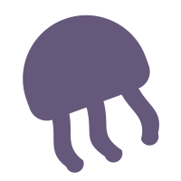
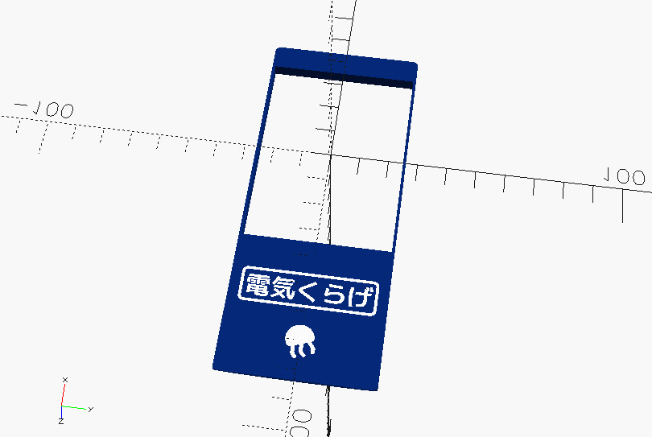
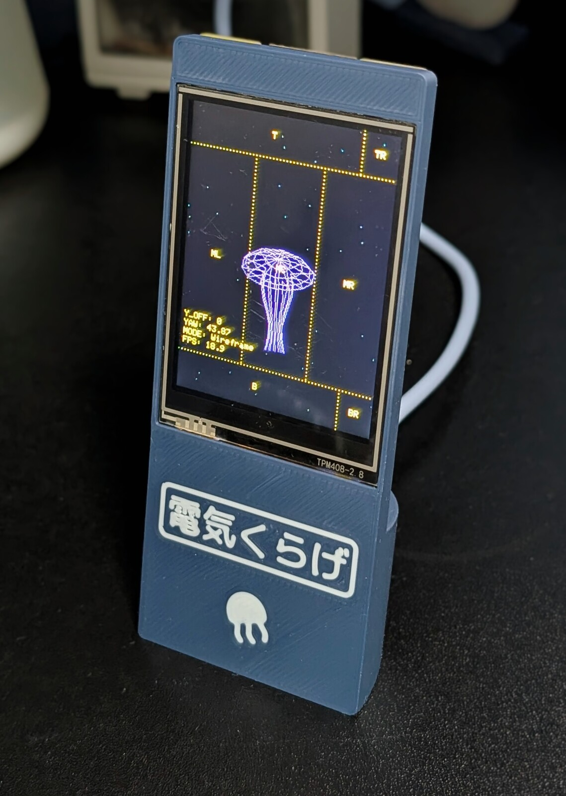
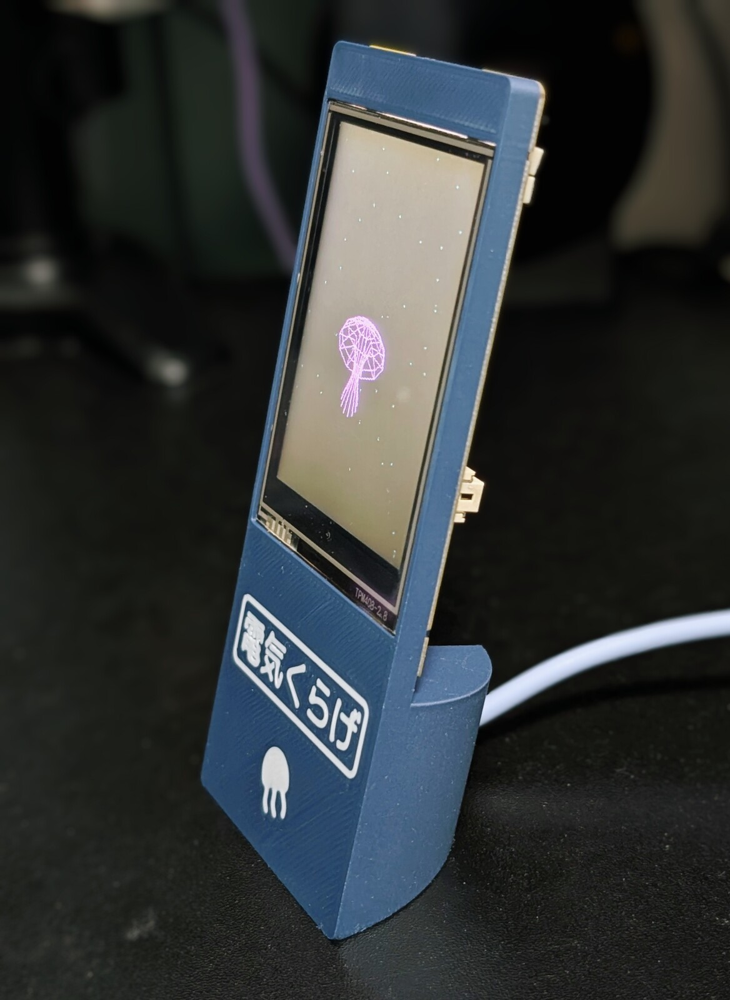
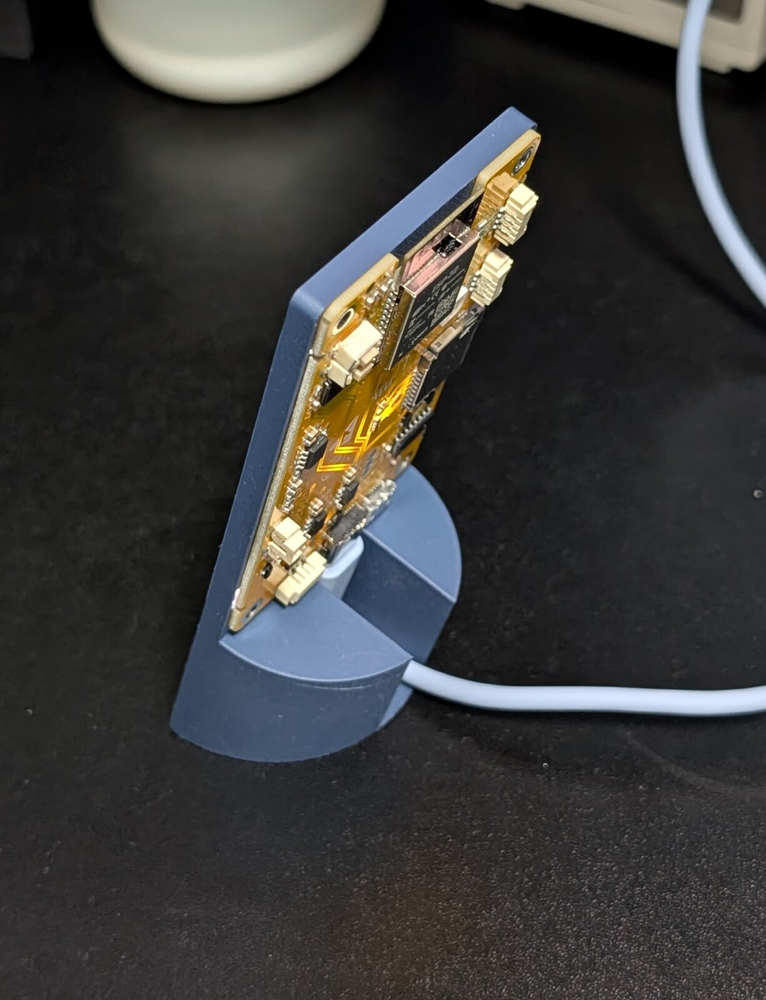

<video src="https://github.com/user-attachments/assets/62c911e7-4eb1-4285-9e28-48d6acbe1837" height="300px" autoplay loop muted playsinline></video>

#  Denki Kurage

`Denki Kurage` (ja: 電気くらげ, electric jellyfish)

A sort of an artificial jellyfish on CYD (Cheap Yellow Display, ESP32).

- Retro, low-poly 3D jellyfish animation for the CYD, an ESP32 development board with an integrated screen.
- Touch the screen to change color modes or adjust the water current speed.
- Customizable enclosure designed with OpenSCAD.
- **Just watch the jellyfish swimming and chill.**

_This project is currently only for the CYD2USB (CYD variants with a USB-C port)._

## BOM

| Component                        | Quantity | Notes                                                  |
| :------------------------------- | :------- | :----------------------------------------------------- |
| ESP32-2432S028 (CYD2USB variant) | 1        | 2.8" TFT "Cheap Yellow Display" with USB-C + Micro USB |
| M2x3 Self-Tapping screw          | 4        |                                                        |

## Getting Started

1. Print the enclosure: Use the 3MF files in [`./enclosure`](./enclosure) to 3D print the stand.
2. Flash the firmware: Use the [Web Flasher](https://likeablob.github.io/denki-kurage/) to flash the latest firmware directly from your browser.
3. Assemble: Put the CYD into the enclosure and secure it with four M2x3 self-tapping screws.

## 3D Printed Parts

For .3mf and .scad files, see [`./enclosure`](./enclosure).



## Controls (Touch)

<video src="https://github.com/user-attachments/assets/3129b887-57ab-4135-a686-5584df11771e" height="300px" autoplay loop muted playsinline></video>

| Area                                 | Action             |
| :----------------------------------- | :----------------- |
| Top / Bottom strip (Left side)       | **Move Up / Down** |
| Middle left / Middle right           | **Rotate Camera**  |
| Center area                          | **Cycle Colors**   |
| Top-right corner (Solid / Wireframe) | **Toggle Mode**    |
| Bottom-right corner                  | **Debug Info**     |

## Building from source

Built and flashed using [PlatformIO](https://platformio.org/).

```bash
pio run -t upload
```

## Gallery

<div>




<video src="https://github.com/user-attachments/assets/8bef5e71-7549-4883-ab79-739655af0c46" height="300px" autoplay loop muted playsinline></video>
</div>

## Acknowledgements

- [TFT_eSPI](https://github.com/Bodmer/TFT_eSPI) by Bodmer
- [XPT2046_Touchscreen](https://github.com/PaulStoffregen/XPT2046_Touchscreen) by Paul Stoffregen
- [ESP32-Cheap-Yellow-Display](https://github.com/witnessmenow/ESP32-Cheap-Yellow-Display) by Witnessmenow
- [BOSL2](https://github.com/BelfrySCAD/BOSL2) library for enclosure design
- [M+ FONTS](https://mplusfonts.github.io/) for typography
- [人工くらげ](https://jnc-klg.sakura.ne.jp/) for the inspiration
- A reference to Philip K. Dick's [Electric Sheep](https://en.wikipedia.org/wiki/Do_Androids_Dream_of_Electric_Sheep%3F) (ja: 電気羊)

## License

- **Software**: MIT
- **Font (M+ FONTS)**: [SIL Open Font License](https://scripts.sil.org/OFL). M+ FONTS are free to use, modify, and redistribute.
